# MicroServices
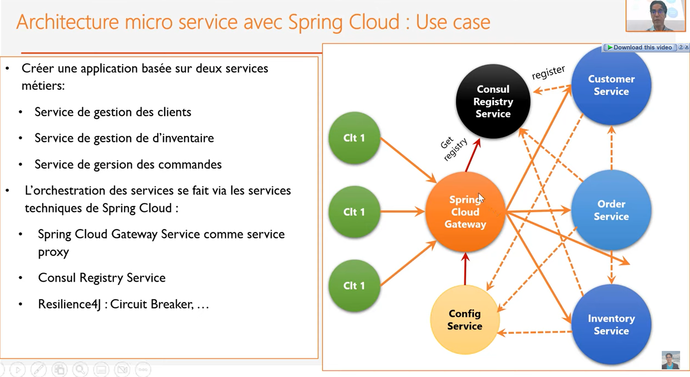
## Discovery service using Consul
Open Source Service Discovery

A tool for service discovery, monitoring and configuration. Consul is a tool for service discovery and configuration. Consul is distributed, highly available, and extremely scalable;

possibility to share configuration and tokens

## Config service
add to configService class `@EnableConfigServer`
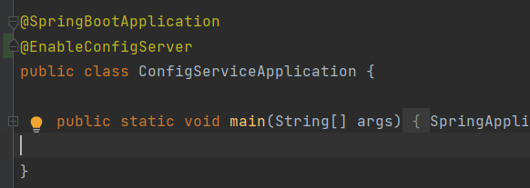
### config folder

    Now we should create a folder where the services vonfiguration would be stored and it should be a git repository (it could be only locally).

    for each service we can add gonfigurations depending on their environment

    for example if we want to add configuration for different environment
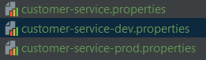


next is adding the path / link in config service `application.properties`
- link to github : `spring.cloud.config.server.git.uri=link-to-github-repo-folder`
- local path : `spring.cloud.config.server.git.uri=file:///path`

the git repo should be an external repository (Outside the microservice)

after running the service using the dommand : `consul agent -server -bootstrap-expect=1 -data-dir=consul-data -ui -bind=192.168.1.18`

we can see it in the consul services 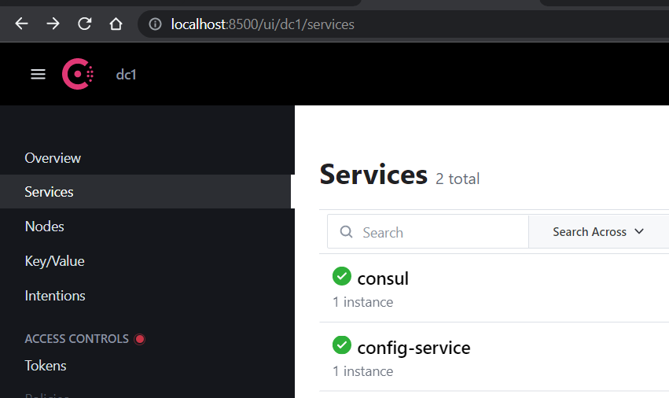

if doesn't show up add this annotation in the ConfigService class `@EnableDiscoveryClient`

this is because we added this dependency to the service we want to be discovered by consul
```xml
<dependency>
			<groupId>org.springframework.cloud</groupId>
			<artifactId>spring-cloud-starter-consul-discovery</artifactId>
</dependency>
```
To get the configuration for each service : 

For example to get the default environment customer service configuration go to the configuration service in the url `http://localhost:8888/customer-service/default` 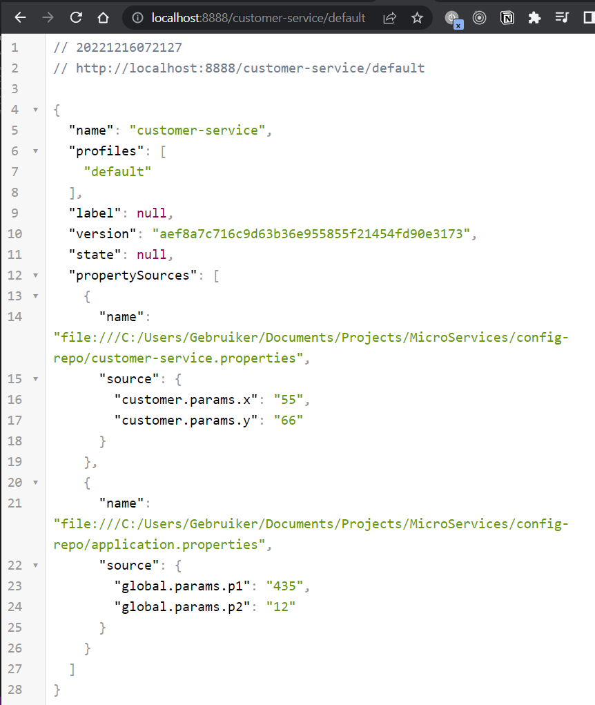

to get dev environment customer configuration : `http://localhost:8888/customer-service/dev`

the file was named as 

## Customer service

in `application.properties` for the service to know where to look for the config service add this configuration : 
```properties
spring.config.import=optional:configserver:http://localhost:8888
```
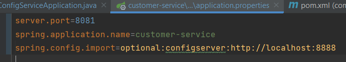

### get environment config using `@RestController`
Add annotation `@Value("${paramName}")`
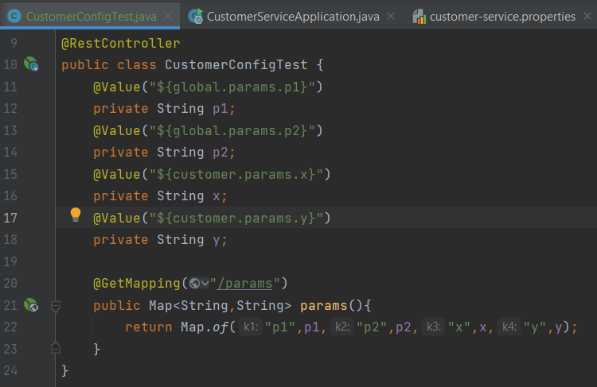

The result of visiting : 

To make the service refresh the params when they are changed in the configurations we need to add the annotation `@RefreshScope` on the Controller

now to refresh the params in the service without the need to restart the whole service, we send a POST request to the following endpoint : `POST http://localhost:8081/actuator/refresh`

:warning: you need first to set expose the endpoint by adding `management.endpoints.web.exposure.include=*` in the application.prperties 
`* for all or add just spesific endpoint` 

### Customer Entity
```java
@Entity
@Data
@NoArgsConstructor @AllArgsConstructor
@Builder
public class Customer {
    @Id @GeneratedValue(strategy = GenerationType.IDENTITY)
    private Long id;
    private String name;
    private String email;
}
```

### Customer Repository
```java
@RepositoryRestResource
public interface CustomerRepository extends JpaRepository<Customer,Long> {
}
```

### adding some test customers
```java
@Bean
	CommandLineRunner start(CustomerRepository customerRepository){
		return args -> {
			customerRepository.saveAll(List.of(
					Customer.builder().name("name1").email("email1").build(),
					Customer.builder().name("name2").email("email2").build(),
					Customer.builder().name("name3").email("email3").build()
			));
			customerRepository.findAll().forEach(System.out::println);
		};
	}
```
### projection
```java 
@Projection(name = "fullCustomer" ,types = Customer.class)
public interface CustomerProjection {
    public Long getId();
    public String getName();
    public String getEmail();
}
```
to access : `http://localhost:9999/customer-service/customers/1?projection=fullCustomer`
result difference :
- Without projection :
```json
// 20221216222317
// http://localhost:9999/customer-service/customers/1

{
  "name": "name1",
  "email": "email1",
  "_links": {
    "self": {
      "href": "http://DESKTOP-O3PE8AE:8081/customers/1"
    },
    "customer": {
      "href": "http://DESKTOP-O3PE8AE:8081/customers/1{?projection}",
      "templated": true
    }
  }
}
```
- with projection
```json
// 20221216222823
// http://localhost:9999/customer-service/customers/1?projection=fullCustomer

{
  "name": "name1",
  "id": 1,
  "email": "email1",
  "_links": {
    "self": {
      "href": "http://DESKTOP-O3PE8AE:8081/customers/1"
    },
    "customer": {
      "href": "http://DESKTOP-O3PE8AE:8081/customers/1{?projection}",
      "templated": true
    }
  }
}
```
## Discovery Service
main class :
```java
@SpringBootApplication
public class GatewayServiceApplication {

	public static void main(String[] args) {
		SpringApplication.run(GatewayServiceApplication.class, args);
	}

	@Bean
	DiscoveryClientRouteDefinitionLocator dynamicRoutes(ReactiveDiscoveryClient rdc,
														DiscoveryLocatorProperties dlp){
		return new DiscoveryClientRouteDefinitionLocator(rdc,dlp);
	}
}
```
necessary dependency 
```xml
<dependency>
			<groupId>org.springframework.cloud</groupId>
			<artifactId>spring-cloud-starter-config</artifactId>
		</dependency>
```
## inventory service
## order service
 
 to log information on requests add application.properties in the orderService : 
 ```properties
logging.level.ma.laayouni.orderservice.services.CustomerRestClientService=debug
logging.level.ma.laayouni.orderservice.services.InventoryRestClientService=debug
feign.client.config.default.logger-level=full
```
- Order projection :
```java
@Projection(name = "fullOrder",types = Order.class)
public interface OrderProjection {
    Long getId();
    Date getCreatedAt();
    Long getCustomerId();
    OrderStatus getStatus();
}
```
`http://localhost:9999/order-service/orders/search/byCustomerId?customerId=1&projection=fullOrder`

## billing service (trying vault)
```java
@RestController
public class ConsulConfigRestController {

    @Autowired
    private MyConsulConfig myConsulConfig;
 
    @GetMapping("/myConfig")
    public MyConsulConfig myConfig(){
        return myConsulConfig;
    }
}
```
```java
@Component
@ConfigurationProperties(prefix ="token")
@Data
public class MyConsulConfig {
    private long accessTokenTimeout;
    private long refreshTokenTimeout;

}
```
- Start vault with :`vault server -dev`
- set vault address :`set VAULT_ADDR="http://127.0.0.1:8200"`
- add key value :`vault.exe kv put secret/billing-service user.username=mouad user.password=12345678` 
How can a microservice access this data ?
- add these properties to the service :
   ```properties
   spring.cloud.vault.token=hvs.e7VE39m7Jw7m9fRnRig5061G
   spring.cloud.vault.scheme=http
   spring.cloud.vault.kv.enabled=true
   spring.config.import=optional:consul:, vault://
   management.endpoints.web.exposure.include=*
  ```
- token can be found when starting vault : 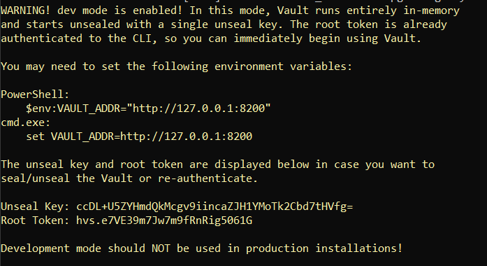

# Frontend Angular
(WIP)
- Product display
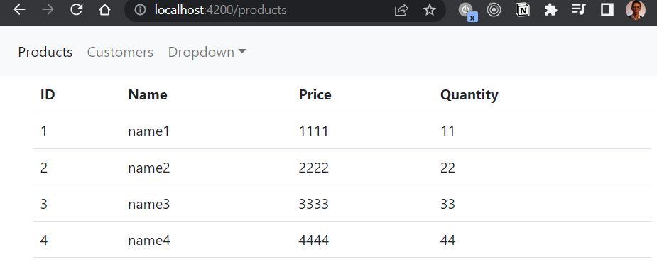
- Customer displqy
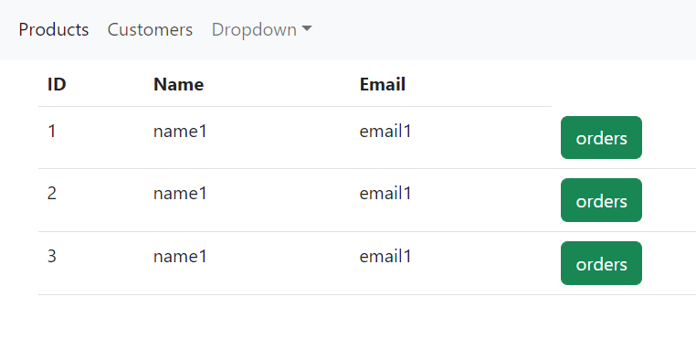
- Orders be Customer
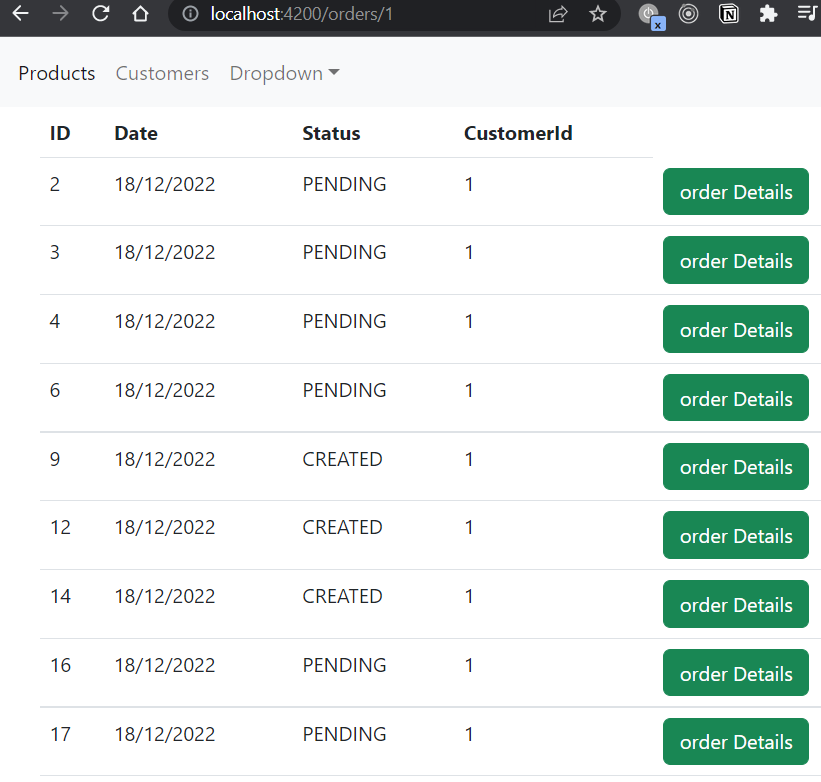